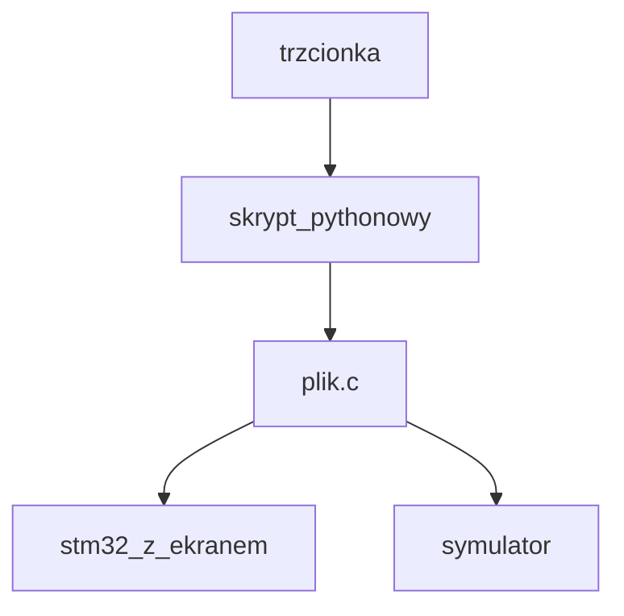
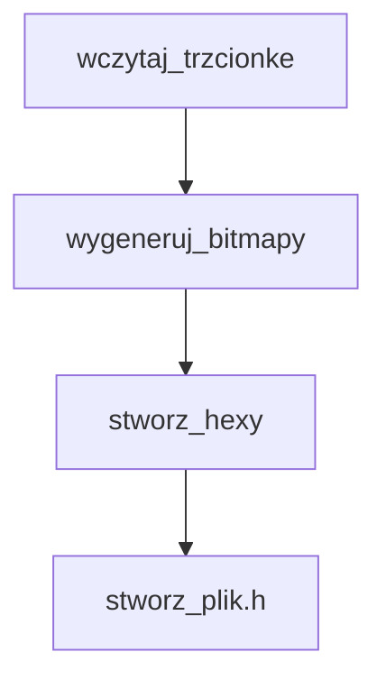

```python

def create_font(
    output_file_path: str,
    font_width: int,
    font_height: int,
    is_horizontal: bool,
    first_character: int,
    last_character: int,
    unknown_character: int
):
    raise NotImplemented()

```
```c
// Font descriptor
typedef struct {
	uint8_t font_Width;       // Width of character
	uint8_t font_Height;      // Height of character
	uint8_t font_BPC;         // Bytes for one character
	uint8_t font_Scan;        // Font scan lines behavior
	uint8_t font_MinChar;     // Code of the first known symbol
	uint8_t font_MaxChar;     // Code of the last known symbol
	uint8_t font_UnknownChar; // Code of the unknown symbol
	uint8_t font_Data[];      // Font data
} Font_TypeDef;

enum {
	FONT_V = (uint8_t)0,        // Vertical font scan lines
	FONT_H = (uint8_t)(!FONT_V) // Horizontal font scan lines
};


```
```c
// Draw a single character
// input:
//   X,Y - character top left corner coordinates
//   Char - character to be drawn
//   Font - pointer to font
// return: character width in pixels
uint8_t LCD_PutChar(uint8_t X, uint8_t Y, uint8_t Char, const Font_TypeDef *Font) {
	uint8_t pX;
	uint8_t pY;
	uint8_t tmpCh;
	uint8_t bL;
	const uint8_t *pCh;

	// If the specified character code is out of bounds should substitute the code of the "unknown" character
	if (Char < Font->font_MinChar || Char > Font->font_MaxChar) Char = Font->font_UnknownChar;

	// Pointer to the first byte of character in font data array
	pCh = &Font->font_Data[(Char - Font->font_MinChar) * Font->font_BPC];

	// Draw character
	if (Font->font_Scan == FONT_V) {
		// Vertical pixels order
		if (Font->font_Height < 9) {
			// Height is 8 pixels or less (one byte per column)
			pX = X;
			while (pX < X + Font->font_Width) {
				pY = Y;
				tmpCh = *pCh++;
				while (tmpCh) {
					if (tmpCh & 0x01) LCD_Pixel(pX,pY,LCD_PixelMode);
					tmpCh >>= 1;
					pY++;
				}
				pX++;
			}
		} else {
			// Height is more than 8 pixels (several bytes per column)
			pX = X;
			while (pX < X + Font->font_Width) {
				pY = Y;
				while (pY < Y + Font->font_Height) {
					bL = 8;
					tmpCh = *pCh++;
					if (tmpCh) {
						while (bL) {
							if (tmpCh & 0x01) LCD_Pixel(pX,pY,LCD_PixelMode);
							tmpCh >>= 1;
							if (tmpCh) {
								pY++;
								bL--;
							} else {
								pY += bL;
								break;
							}
						}
					} else {
						pY += bL;
					}
				}
				pX++;
			}
		}
	} else {
		// Horizontal pixels order
		if (Font->font_Width < 9) {
			// Width is 8 pixels or less (one byte per row)
			pY = Y;
			while (pY < Y + Font->font_Height) {
				pX = X;
				tmpCh = *pCh++;
				while (tmpCh) {
					if (tmpCh & 0x01) LCD_Pixel(pX,pY,LCD_PixelMode);
					tmpCh >>= 1;
					pX++;
				}
				pY++;
			}
		} else {
			// Width is more than 8 pixels (several bytes per row)
			pY = Y;
			while (pY < Y + Font->font_Height) {
				pX = X;
				while (pX < X + Font->font_Width) {
					bL = 8;
					tmpCh = *pCh++;
					if (tmpCh) {
						while (bL) {
							if (tmpCh & 0x01) LCD_Pixel(pX,pY,LCD_PixelMode);
							tmpCh >>= 1;
							if (tmpCh) {
								pX++;
								bL--;
							} else {
								pX += bL;
								break;
							}
						}
					} else {
						pX += bL;
					}
				}
				pY++;
			}
		}
	}

	return Font->font_Width + 1;
}

```


```c
#ifndef __FONT7x10_H
#define __FONT7x10_H

#define fnt7x10 &Font7x10

static const Font_TypeDef Font7x10 = {
		7,           // Font width - max 8
		10,          // Font height
		10,          // Bytes per character
		FONT_H,      // Horizontal font scan lines
		32,          // First character: space
		126,         // Last character: '~'
		126,         // Unknown character: '~'
		{
				0x00,0x00,0x00,0x00,0x00,0x00,0x00,0x00,0x00,0x00, //   (20)
				0x18,0x18,0x18,0x18,0x18,0x18,0x18,0x00,0x18,0x18, // ! (21)
				0x36,0x36,0x36,0x36,0x00,0x00,0x00,0x00,0x00,0x00, // " (22)
				0x00,0x36,0x36,0x7F,0x7F,0x36,0x7F,0x7F,0x36,0x36, // # (23)
				0x08,0x3E,0x6B,0x0B,0x0E,0x38,0x68,0x6B,0x3E,0x08, // $ (24)
				0x67,0x65,0x37,0x18,0x18,0x0C,0x0C,0x76,0x53,0x73, // % (25)
				0x00,0x00,0x00,0x1E,0x33,0x33,0x1E,0x73,0x33,0x7E, // & (26)
				0x18,0x18,0x18,0x18,0x00,0x00,0x00,0x00,0x00,0x00, // ' (27)
				0x30,0x18,0x0C,0x0C,0x06,0x06,0x0C,0x0C,0x18,0x30, // ( (28)
				0x06,0x0C,0x18,0x18,0x30,0x30,0x18,0x18,0x0C,0x06, // ) (29)
				0x00,0x00,0x08,0x08,0x7F,0x1C,0x1C,0x36,0x22,0x00, // * (2A)
				0x00,0x00,0x18,0x18,0x7E,0x7E,0x18,0x18,0x00,0x00, // + (2B)
				0x00,0x00,0x00,0x00,0x00,0x3C,0x38,0x38,0x18,0x0C, // , (2C)
				0x00,0x00,0x00,0x00,0x7F,0x7F,0x00,0x00,0x00,0x00, // - (2D)
				0x00,0x00,0x00,0x00,0x00,0x00,0x00,0x18,0x3C,0x18, // . (2E)
				0x40,0x60,0x60,0x30,0x18,0x0C,0x06,0x03,0x03,0x01, // / (2F)
				0x1C,0x36,0x63,0x63,0x63,0x63,0x63,0x63,0x36,0x1C, // 0 (30)
				0x18,0x1C,0x1E,0x18,0x18,0x18,0x18,0x18,0x18,0x7E, // 1 (31)
				0x3E,0x63,0x63,0x60,0x30,0x18,0x0C,0x06,0x03,0x7F, // 2 (32)
				0x7F,0x60,0x30,0x18,0x3C,0x60,0x60,0x60,0x63,0x3E, // 3 (33)
				0x30,0x38,0x3C,0x36,0x33,0x33,0x7F,0x30,0x30,0x30, // 4 (34)
				0x7F,0x03,0x03,0x3F,0x67,0x60,0x60,0x60,0x63,0x3E, // 5 (35)
				0x3C,0x06,0x03,0x03,0x3F,0x67,0x63,0x63,0x67,0x3E, // 6 (36)
				0x7F,0x60,0x60,0x30,0x18,0x18,0x0C,0x0C,0x0C,0x0C, // 7 (37)
				0x3E,0x63,0x63,0x63,0x3E,0x63,0x63,0x63,0x63,0x3E, // 8 (38)
				0x3E,0x73,0x63,0x63,0x73,0x7E,0x60,0x60,0x30,0x1E, // 9 (39)
				0x00,0x1C,0x1C,0x1C,0x00,0x00,0x1C,0x1C,0x1C,0x00, // : (3A)
				0x00,0x18,0x3C,0x18,0x00,0x3C,0x38,0x38,0x18,0x0C, // ; (3B)
				0x00,0x60,0x30,0x18,0x0C,0x06,0x0C,0x18,0x30,0x60, // < (3C)
				0x00,0x00,0x00,0x00,0x7E,0x00,0x00,0x7E,0x00,0x00, // = (3D)
				0x00,0x06,0x0C,0x18,0x30,0x60,0x30,0x18,0x0C,0x06, // > (3E)
				0x3E,0x63,0x63,0x60,0x30,0x18,0x18,0x00,0x18,0x18, // ? (3F)
				0x00,0x3E,0x7F,0x73,0x7B,0x4B,0x4B,0x7B,0x07,0x7E, // @ (40)
				0x1C,0x3E,0x63,0x63,0x63,0x7F,0x63,0x63,0x63,0x63, // A (41)
				0x3F,0x66,0x66,0x66,0x3E,0x66,0x66,0x66,0x66,0x3F, // B (42)
				0x3E,0x67,0x63,0x03,0x03,0x03,0x03,0x63,0x67,0x3E, // C (43)
				0x3F,0x66,0x66,0x66,0x66,0x66,0x66,0x66,0x66,0x3F, // D (44)
				0x7F,0x03,0x03,0x03,0x1F,0x03,0x03,0x03,0x03,0x7F, // E (45)
				0x7F,0x03,0x03,0x03,0x1F,0x03,0x03,0x03,0x03,0x03, // F (46)
				0x3E,0x63,0x63,0x03,0x03,0x03,0x73,0x63,0x63,0x3E, // G (47)
				0x63,0x63,0x63,0x63,0x7F,0x63,0x63,0x63,0x63,0x63, // H (48)
				0x3C,0x18,0x18,0x18,0x18,0x18,0x18,0x18,0x18,0x3C, // I (49)
				0x70,0x60,0x60,0x60,0x60,0x60,0x60,0x63,0x63,0x3E, // J (4A)
				0x63,0x63,0x33,0x1B,0x0F,0x0F,0x1B,0x33,0x63,0x63, // K (4B)
				0x03,0x03,0x03,0x03,0x03,0x03,0x03,0x03,0x43,0x7F, // L (4C)
				0x63,0x63,0x77,0x7F,0x6B,0x63,0x63,0x63,0x63,0x63, // M (4D)
				0x63,0x63,0x67,0x67,0x6F,0x7B,0x73,0x73,0x63,0x63, // N (4E)
				0x3E,0x63,0x63,0x63,0x63,0x63,0x63,0x63,0x63,0x3E, // O (4F)
				0x3F,0x63,0x63,0x63,0x63,0x3F,0x03,0x03,0x03,0x03, // P (50)
				0x3E,0x63,0x63,0x63,0x63,0x63,0x63,0x7B,0x3E,0x60, // Q (51)
				0x3F,0x63,0x63,0x63,0x3F,0x1F,0x33,0x33,0x63,0x63, // R (52)
				0x3E,0x63,0x63,0x03,0x3E,0x60,0x60,0x63,0x63,0x3E, // S (53)
				0x7E,0x18,0x18,0x18,0x18,0x18,0x18,0x18,0x18,0x18, // T (54)
				0x63,0x63,0x63,0x63,0x63,0x63,0x63,0x63,0x63,0x3E, // U (55)
				0x63,0x63,0x63,0x63,0x22,0x36,0x36,0x1C,0x1C,0x08, // V (56)
				0x63,0x63,0x63,0x63,0x63,0x63,0x6B,0x6B,0x7F,0x36, // W (57)
				0x63,0x63,0x36,0x36,0x1C,0x1C,0x36,0x36,0x63,0x63, // X (58)
				0x66,0x66,0x66,0x3C,0x3C,0x18,0x18,0x18,0x18,0x18, // Y (59)
				0x7F,0x60,0x60,0x30,0x18,0x0C,0x06,0x03,0x03,0x7F, // Z (5A)
				0x3E,0x06,0x06,0x06,0x06,0x06,0x06,0x06,0x06,0x3E, // [ (5B)
				0x01,0x03,0x03,0x06,0x0C,0x18,0x30,0x60,0x60,0x40, // \ (5C)
				0x3E,0x30,0x30,0x30,0x30,0x30,0x30,0x30,0x30,0x3E, // ] (5D)
				0x08,0x1C,0x36,0x63,0x00,0x00,0x00,0x00,0x00,0x00, // ^ (5E)
				0x00,0x00,0x00,0x00,0x00,0x00,0x00,0x00,0x00,0x7F, // _ (5F)
				0x0C,0x18,0x30,0x00,0x00,0x00,0x00,0x00,0x00,0x00, // ` (60)
				0x00,0x00,0x00,0x3E,0x60,0x7E,0x63,0x63,0x73,0x6E, // a (61)
				0x03,0x03,0x03,0x3B,0x67,0x63,0x63,0x63,0x67,0x3B, // b (62)
				0x00,0x00,0x00,0x3E,0x67,0x03,0x03,0x03,0x67,0x3E, // c (63)
				0x60,0x60,0x60,0x6E,0x73,0x63,0x63,0x63,0x73,0x6E, // d (64)
				0x00,0x00,0x00,0x3E,0x63,0x63,0x7F,0x03,0x63,0x3E, // e (65)
				0x3C,0x66,0x06,0x06,0x06,0x3F,0x06,0x06,0x06,0x06, // f (66)
				0x00,0x00,0x00,0x7E,0x33,0x1E,0x0F,0x3E,0x63,0x3E, // g (67)
				0x03,0x03,0x03,0x3B,0x67,0x63,0x63,0x63,0x63,0x63, // h (68)
				0x00,0x18,0x18,0x00,0x1C,0x18,0x18,0x18,0x18,0x3C, // i (69)
				0x00,0x60,0x60,0x00,0x70,0x60,0x60,0x63,0x63,0x3E, // j (6A)
				0x03,0x03,0x03,0x33,0x1B,0x0F,0x0F,0x1B,0x33,0x63, // k (6B)
				0x1C,0x18,0x18,0x18,0x18,0x18,0x18,0x18,0x18,0x3C, // l (6C)
				0x00,0x00,0x00,0x36,0x7F,0x6B,0x6B,0x63,0x63,0x63, // m (6D)
				0x00,0x00,0x00,0x3B,0x67,0x63,0x63,0x63,0x63,0x63, // n (6E)
				0x00,0x00,0x00,0x3E,0x63,0x63,0x63,0x63,0x63,0x3E, // o (6F)
				0x00,0x00,0x00,0x3B,0x67,0x63,0x67,0x3B,0x03,0x03, // p (70)
				0x00,0x00,0x00,0x6E,0x73,0x63,0x73,0x6E,0x60,0x60, // q (71)
				0x00,0x00,0x00,0x3B,0x67,0x03,0x03,0x03,0x03,0x03, // r (72)
				0x00,0x00,0x00,0x3E,0x63,0x06,0x1C,0x30,0x63,0x3E, // s (73)
				0x06,0x06,0x06,0x06,0x3F,0x06,0x06,0x06,0x66,0x3C, // t (74)
				0x00,0x00,0x00,0x63,0x63,0x63,0x63,0x63,0x73,0x6E, // u (75)
				0x00,0x00,0x00,0x63,0x63,0x63,0x63,0x36,0x36,0x1C, // v (76)
				0x00,0x00,0x00,0x63,0x63,0x63,0x6B,0x6B,0x7F,0x36, // w (77)
				0x00,0x00,0x00,0x63,0x63,0x36,0x1C,0x36,0x63,0x63, // x (78)
				0x00,0x00,0x00,0x63,0x63,0x73,0x6E,0x60,0x63,0x3E, // y (79)
				0x00,0x00,0x00,0x7F,0x30,0x18,0x0C,0x06,0x03,0x7F, // z (7A)
				0x00,0x78,0x0C,0x0C,0x18,0x0E,0x18,0x0C,0x0C,0x78, // { (7B)
				0x18,0x18,0x18,0x18,0x18,0x18,0x18,0x18,0x18,0x18, // | (7C)
				0x00,0x1E,0x30,0x30,0x18,0x70,0x18,0x30,0x30,0x1E, // } (7D)
				0x00,0x4E,0x7F,0x39,0x00,0x00,0x00,0x00,0x00,0x00  // ~ (7E)
		}
};

#endif // __FONT7x10_H


const char[] character_set = [
    ' ',    
    '!',
    '"',
    '#',
    '$',
    '%',
    '&',
    '\'',
    '(',
    ')',
    '*',
    '+',
    ',',
    '-',
    '.',
    '/',
    '0',
    '1',
    '2',
    '3',
    '4',
    '5',
    '6',
    '7',
    '8',
    '9',
    ':',
    ';',
    '<',
    '=',
    '>',
    '?',
    '@',
    'A',
    'B',
    'C',
    'D',
    'E',
    'F',
    'G',
    'H',
    'I',
    'J',
    'K',
    'L',
    'M',
    'N',
    'O',
    'P',
    'Q',
    'R',
    'S',
    'T',
    'U',
    'V',
    'W',
    'X',
    'Y',
    'Z',
    '[',
    '\\',
    ']',
    '^',
    '_',
    '`',
    'a',
    'b',
    'c',
    'd',
    'e',
    'f',
    'g',
    'h',
    'i',
    'j',
    'k',
    'l',
    'm',
    'n',
    'o',
    'p',
    'q',
    'r',
    's',
    't',
    'u',
    'v',
    'w',
    'x',
    'y',
    'z',
    '{',
    '|',
    '}',
    '~'
]


```